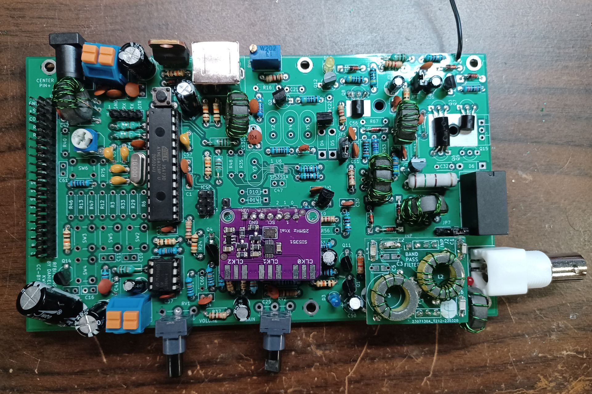
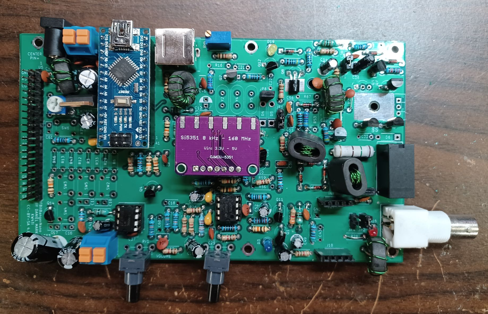

# RFBitBanger
The RFBitBanger is an off-the-grid QRP radio.  It is not just designed to be used off the grid, it is designed to be assembled and maintained off-the-grid.  Most radios require specialized parts that would be difficult to obtain in an extreme parts shortage or in remote places.  This radio is designed to be assembled and maintained using the most common jellybean components that might be in a hobbyist junkpile.  It will mainly support low bandwidth/digital modes to make the most of limited power.  

A presentation presented at the 2023 QSO Today conference on the RFBitBanger can be viewed on Youtube [here](https://www.youtube.com/watch?v=Fbgs_4QsKnE).

Design goals:

* A single band double-sideband radio, with the band changed by pluggable external filters on 20 m to 80 m.  A double-balanced ring mixer is used to provide good rejection of strong stations while not requiring any custom ICs such as SA612 or FST3253.  The mixer has strong drive to reduce nonlinearity.
* Can be assembled and operated by a properly licensed individual that may not have a great deal of electronics experience or experience at making HF contacts.  The radio is made from readily available through-hole parts which are widely available and have multiple vendor alternatives.  
* The parts needed are very common so that cheap spare parts can be stockpiled or scrounged from other equipment so that the radio may be more easily maintained in off-grid conditions.  The includes ATMEGA328P/Arduino Nano, LM358 op-amp, LM386 audio amplifier, 2N7000 MOSFETs, 2N3904 NPN transistor, SS8550 PNP transistor, and a HD44780 display.  It can use a SI5351A frequency synthesizer IC soldered to the board, or a plug-in SI5351A developmnet module.  There is a MS5351 workalike for this IC as well.  Ferrite cores are needed for transformers/chokes which can be easily bought (FT50-43) or scrounged as EMI suppression beads from cables.
* The radio has a novel digital mode called SCAMP, implemented on a ATMEGA328P (Arduino processor) which performs coherent FSK demodulation and forward error correction to achieve excellent performance in weak signal conditions.  No PC is required for this digital mode; it is implemented all on the Arduino.  The mode is designed to be simple to set up to make it easy to initiate a contact.
* It has a 50 ohm output and can use a simple quarter wave wire as an antenna.  A built-in RF ammeter with LED helps one adjust the length of the antenna for maximum radiation.
* The output power amplifier consists of 3 2N7000 transistors driven by a fourth 2N7000 transistor.  2N7000 transistors can be found generically for $0.03 each.  The output power stage is a class E amplifier with 3.5 to 5.0 W output based on serial resonance filters.  The best performance is obtained by using NP0/C0G capacitors and T50-6 core inductors, however, high voltage ceramic disc capacitors and air-core inductors can be used as substitutes with reduced performance.  The serial resonance filter is on a pluggable module that is replaced for each band.  BS170 transistors may be substituted for 2N7000 transistors easily as these have the reverse pinout to the 2N7000.
* It has PCBs available for the transceiver, but it could also be built on perfboard or using point-to-point wiring.  The PCB, however, is likely to be better performing.  There are also PCBs available for the filters.
* A jumper allows the amplifier board to be bypassed on receive to achieve MF and HF coverage.  The DSB receiver can be used with limitations as a receiver for the AM broadcast band and AM broadcast shortwave bands.
* It has an audio speaker output based on the LM386 IC.
* A second display board breaks out the display, and optional inputs for a microphone, a straight or iambic key, and a headphone/speaker jack.  
* A PS/2 keyboard is supported for full operation of the transceiver, including message entry, frequency selection, and data mode selection.
* There are five buttons corresponding to four arrow keys and an enter key.  Alphanumeric messages may be entered this way if necessary.
* There is a full complement of support for CW, including keyclick elimination on transmit, a built-in CW decoder, a CW encoder, and straight and iambic key support.
* RTTY 45/170 is supported as a mode for transmit and reception.
* Uses a common 2X16 HD44780-based LCD display.
* The hardware is there for supporting SSB transmission based on the same method of the uSDX of frequency tracking and envelope recovery.  This is not implemented currently in software.
* Includes a 3d printable case, a 3d printable iambic key, and 3d printable coil forms for air core inductors.
* The PCBs are licensed under the CC-BY-SA 4.0 open source license, and the source code is licensed under the zlib open source license.

The RFBitBanger folder is the schematic and PCB for the radio itself.  The MatchTest is a PCB that has a directional coupler for measuring forward/reverse power as well as a reflection bridge to help match antenna impedance.  The Code folder contains the current RFBitBanger code.  The CAD directory contains FreeCAD parametric models and STL files. The Docs directory contains a guide to the transceiver and the details of the SCAMP digital mode implementation.

This design was started after a discuss on the [Collapse OS](http://collapseos.org) mailing list about hardware is maintainable even without access to parts suppliers, for example Digikey/Mouser, etc. or even Amazon.  Projects such as [civboot](https://github.com/civboot/civboot) seek to provide a means of resurrecting technology and infrastructure after a catastrophic event.  This design is to provide a means of communication if other forms of communications become unavailable, especially in rural areas or urban environments with compromised infrastructure.

Any comments to profdc9 AT gmail.com.

